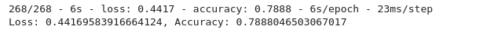

# Neural_Network_Charity_Analysis
Neural Networks and Deep Learning Models

## Background

### Overview of Analysis

This project consists of three technical analysis deliverables and a written report.

* Deliverable 1: Preprocessing Data for a Neural Network Model

* Deliverable 2: Compile, Train, and Evaluate the Model

* Deliverable 3: Optimize the Model

* Deliverable 4: A Written Report on the Neural Network Model (README.md)

### Purpose

To help a foundation predict where to make investments, using machine learning and neural networks, we’ll use the features in the provided dataset to create a binary classifier that is capable of predicting whether applicants will be successful if funded by the fundation.

## Resources

### Data source:

* (1) Alphabet Soup Charity starter code, 

* (2) Alphabet Soup Charity dataset (charity_data.csv)

    * EIN and NAME—Identification columns

    * APPLICATION_TYPE—Alphabet Soup application type

    * AFFILIATION—Affiliated sector of industry

    * CLASSIFICATION—Government organization classification

    * USE_CASE—Use case for funding

    * ORGANIZATION—Organization type

    * STATUS—Active status

    * INCOME_AMT—Income classification

    * SPECIAL_CONSIDERATIONS—Special consideration for application

    * ASK_AMT—Funding amount requested

    * IS_SUCCESSFUL—Was the money used effectively*

### Software:

- Python 3.9.10, Jupyter Lab 4.6, Visual Studio Code 1.71.2
 
 

## Methodology

### D1: Preprocessing Data for a Neural Network Model

Using Pandas and the Scikit-Learn’s StandardScaler(), we’ll need to preprocess the dataset in order to compile, train, and evaluate the neural network model later in Deliverable 2.

 

### D2: Compile, Train, and Evaluate the Model

Using TensorFlow, we’ll design a neural network, or deep learning model, to create a binary classification model that can predict if an Alphabet Soup–funded organization will be successful based on the features in the dataset. You’ll need to think about how many inputs there are before determining the number of neurons and layers in your model. Once you’ve completed that step, you’ll compile, train, and evaluate your binary classification model to calculate the model’s loss and accuracy.

 

### Deliverable 3: Optimize the Model

Using TensorFlow, optimize your model in order to achieve a target predictive accuracy higher than 75%. If you can't achieve an accuracy higher than 75%, you'll need to make at least three attempts to do so.

 

## Results Overview:

### D1: Preprocessing Data for a Neural Network Model

The following preprocessing steps have been performed on the crypto_df DataFrame:

* The EIN and NAME columns have been dropped

* The columns with more than 10 unique values have been grouped together

* The categorical variables have been encoded using one-hot encoding

* The preprocessed data is split into features and target arrays

* The preprocessed data is split into training and testing datasets

* The numerical values have been standardized using the StandardScaler() module

* The final DataFrame is shown below, Figure 1.1

 
 Figure (1.1) X_test_scaled DataFrame: X DataFrame have been standardized using the StandardScaler fit_transform() function.

 

### D2: Compile, Train, and Evaluate the Model

The neural network model using Tensorflow Keras contains working code that performs the following steps:

* The number of layers, the number of neurons per layer, and activation function are defined

* An output layer with an activation function is created

* There is an output for the structure of the model

* There is an output of the model’s loss and accuracy

* The model's weights are saved every 5 epochs

* The results are saved to an HDF5 file

The compiled model and model evaluation are shown below, Figure 1.2 -1.3
 
 
 
 Figure (1.2) Compiled model for D2

 

 
 Figure (1.3) D2 model evaluatio

 

### D3_1:

The model is optimized, and the predictive accuracy is increased to over 75%, or there is working code that makes three attempts to increase model performance using the following steps:

* Noisy variables were removed from features

 
 Figure (1.4) Compiled model D3_1

 

 
 Figure (1.5) D3_1 model evaluation

 

### D3_2

* Additional neurons were added to hidden layers

* Additional hidden layers were added

 
 Figure (1.6) Compiled Model D3_2

 

 
 Figure (1.7) D3_2 model evaluation

 

## D3_3

* The activation function of hidden layers or output layers was changed for optimization

 
 Figure (1.8) D3_3 Compiled Model D3_3

 

 
 Figure (1.9) D3_3 model evaluation

 

* The model's weights are saved every 5 epochs

* The results are saved to an HDF5 file

 

## Results Discussion:

Data Preprocessing:

* What variable(s) are considered the target(s) for your model?
    * 'IS_SUCCESSFUL'

* What variable(s) are considered to be the features for your model?
    * 'APPLICATION_TYPE', 'CLSASSIFICATION', 'NAME'

* What variable(s) are neither targets nor features, and should be removed from the input data?
    * 'STATUS', 'SPECIAL_CONSIDERATIONS'

Compiling, Training, and Evaluating the Model:

* How many neurons, layers, and activation functions did you select for your neural network model, and why?

* D2 (Original Model): **2** hidden layers, activation layer = **'relu'**

    * D3_1: **3** hidden layers, activation function = **'relu'**, increased hidden layers to improve performance

    * D3_2: **4** hidden layers, activatin function = **'sigmoid'**, changed the activation function to improve performance

    * D3_3: **4** hidden layers, activation function = **'sigmoid'**, maintained the model the same because decided to use binned for 'NAME' feature.

* Were you able to achieve the target model performance?

    * We achived our targeted model performance on our third attempt (D3_3) with an accuracy of **79%** 

* What steps did you take to try and increase model performance?

    * Dropped epoch from 100 to 50

    * Dropped low information columns: 'STATUS', 'SPECIAL_CONSIDERATIONS'

    * Binned low occurence value counts:  'APPLICATION_TYPE', 'CLSASSIFICATION'

    * Binned 'NAME' into another category for all values equal or less than 5

    * No change to the model

### Additional analysis: RandoForest benchmark comparison:

A becnchmark analysis was performed using RandomForest for comparison with another model:

* Confusion_Matrix

 
 Figure (1.10) RandomForestClasifier - ConfusionMatrix

 

* Clasification_report

 
 Figure (1.11) Clasification_report

 

* Top Ten features_df

 
 Figure (1.12) Top Ten features_df

 

* Top Ten features visualization

 
 Figure (1.3) Top Ten features visualization

 

## Summary

On this project, we worked primarily with , and  build on this by using using Tensorflow Keras to create a neural network model which employs many different features to predict where to make investments. The original model achived an accuracy of **72%**
 
Then we did 3 attempts to optimize our model with the following results:
* Attempt #1: **73%**
* Attempt #2: **74%**
* Attempt #3: **79%**

As we can see with the first to attempts we did not achived our targeted goal of 75%, but in our 3rd attempt we achived the target with a **79%**

As part of this analysis a bechnark analysis using RandomForest was performed. The model achived an accuracy of **78**%, meeting our target. Therefore this would be another model that could be use for our predictive model.

## References

[Markdown](https://docs.github.com/en/get-started/writing-on-github/getting-started-with-writing-and-formatting-on-github/basic-writing-and-formatting-syntax)

[scikit-learn](https://scikit-learn.org/stable/)
 
[TensorFlow](https://www.tensorflow.org/)

[matplotlib](https://matplotlib.org/stable/api/_as_gen/matplotlib.pyplot.savefig.html)

