# Neural_Network_Charity_Analysis
Neural Networks and Deep Learning Models

## Background

### Overview of Analysis

This project consists of four technical analysis deliverables.

* Deliverable 1: Preprocessing Data for a Neural Network Model

* Deliverable 2: Compile, Train, and Evaluate the Model

* Deliverable 3: Optimize the Model

* Deliverable 4: A Written Report on the Neural Network Model (README.md)

### Purpose

To help a foundation predict where to make investments. Using machine learning and neural networks, we’ll use the features in the provided dataset to create a binary classifier that is capable of predicting whether applicants will be successful if funded by the fundation.

## Resources

### Data source:

* (1) Alphabet Soup Charity starter code, 

* (2) Alphabet Soup Charity dataset (charity_data.csv)

    * EIN and NAME—Identification columns

    * APPLICATION_TYPE—Alphabet Soup application type

    * AFFILIATION—Affiliated sector of industry

    * CLASSIFICATION—Government organization classification

    * USE_CASE—Use case for funding

    * ORGANIZATION—Organization type

    * STATUS—Active status

    * INCOME_AMT—Income classification

    * SPECIAL_CONSIDERATIONS—Special consideration for application

    * ASK_AMT—Funding amount requested

    * IS_SUCCESSFUL—Was the money used effectively*

### Software:

- Python 3.9.10, Jupyter Lab 4.6, Visual Studio Code 1.71.2
 
 

## Methodology

### D1: Preprocessing Data for a Neural Network Model

Using Pandas and the Scikit-Learn’s StandardScaler(), we’ll need to preprocess the dataset in order to compile, train, and evaluate the neural network model later in Deliverable 2.

 

### D2: Compile, Train, and Evaluate the Model

Using TensorFlow, we’ll design a neural network, or deep learning model, to create a binary classification model that can predict if an Alphabet Soup–funded organization will be successful based on the features in the dataset. You’ll need to think about how many inputs there are before determining the number of neurons and layers in your model. Once you’ve completed that step, you’ll compile, train, and evaluate your binary classification model to calculate the model’s loss and accuracy.

 

### Deliverable 3: Optimize the Model

Using TensorFlow, optimize your model in order to achieve a target predictive accuracy higher than 75%. If you can't achieve an accuracy higher than 75%, you'll need to make at least three attempts to do so.

 

## Results:

### D1: Preprocessing Data for a Neural Network Model

The following preprocessing steps have been performed on the crypto_df DataFrame:

* The EIN and NAME columns have been dropped

* The columns with more than 10 unique values have been grouped together

* The categorical variables have been encoded using one-hot encoding

* The preprocessed data is split into features and target arrays

* The preprocessed data is split into training and testing datasets

* The numerical values have been standardized using the StandardScaler() module

* The final DataFrame is shown below, Figure 1.1

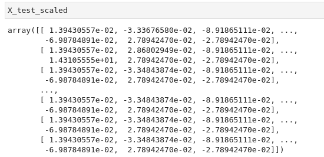
 
 Figure (1.1) X_test_scaled DataFrame: X DataFrame have been standardized using the StandardScaler fit_transform() function.

 

### D2: Compile, Train, and Evaluate the Model

The neural network model using Tensorflow Keras contains working code that performs the following steps:

* The number of layers, the number of neurons per layer, and activation function are defined

* An output layer with an activation function is created

* There is an output for the structure of the model

* There is an output of the model’s loss and accuracy

* The model's weights are saved every 5 epochs

* The results are saved to an HDF5 file

The compiled model and model evaluation are shown below, Figure 1.2 -1.3
 
 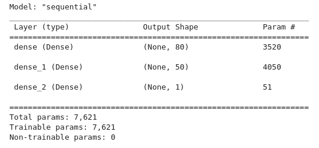
 
 Figure (1.2) X_pca_df DataFrame

 

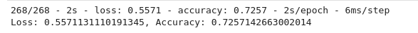
 
 Figure (1.2) X_pca_df DataFrame

 

### D3_1: Clustering Cryptocurrencies Using K-means

The model is optimized, and the predictive accuracy is increased to over 75%, or there is working code that makes three attempts to increase model performance using the following steps:

* Noisy variables are removed from features

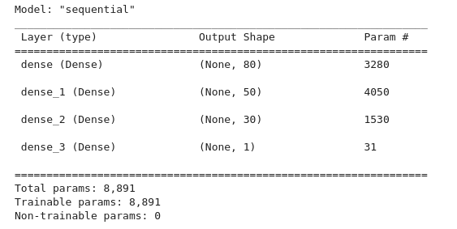
 
 Figure (1.3) Elbow curve

 

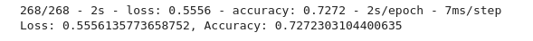
 
 Figure (1.3) Elbow curve

 

### D3_2

* Additional neurons are added to hidden layers

* Additional hidden layers are added

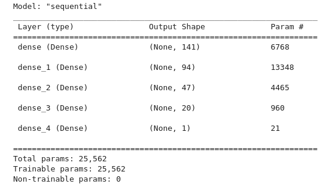
 
 Figure (1.3) Elbow curve

 

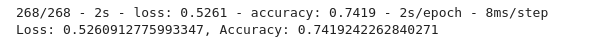
 
 Figure (1.3) Elbow curve

 

## D3_3

* The activation function of hidden layers or output layers is changed for optimization

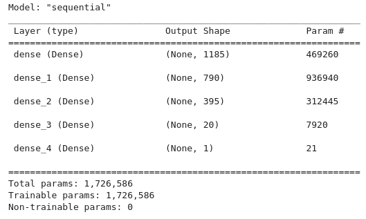
 
 Figure (1.3) Elbow curve

 
* Top Ten features_df

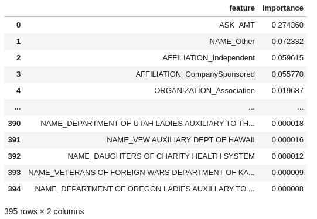
 
 Figure (1.3) Clustered_df DataFrame.

 .3) Elbow curve

 

* The model's weights are saved every 5 epochs

* The results are saved to an HDF5 file

### Additional analysis:

A becnchmark analysis was performed using RandomForest for comparison with another model:

* confusion_matrix

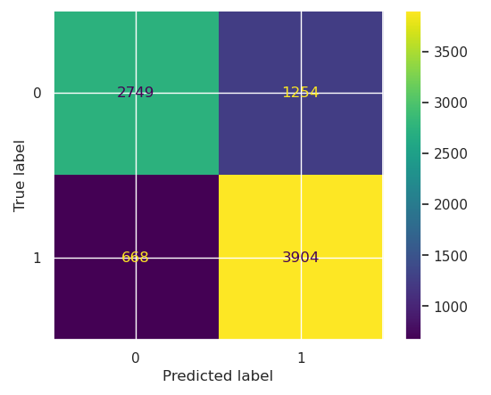
 
 Figure (1.3) Elbow curve

 

* clasification_report

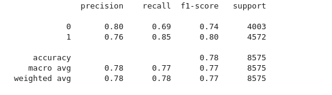
 
 Figure (1.3) K-Means Algorithm: used to cluster the cryptocurrencies.

 

* Top Ten features_df

 
 Figure (1.3) Clustered_df DataFrame.

 

* Top Ten features_df visualization

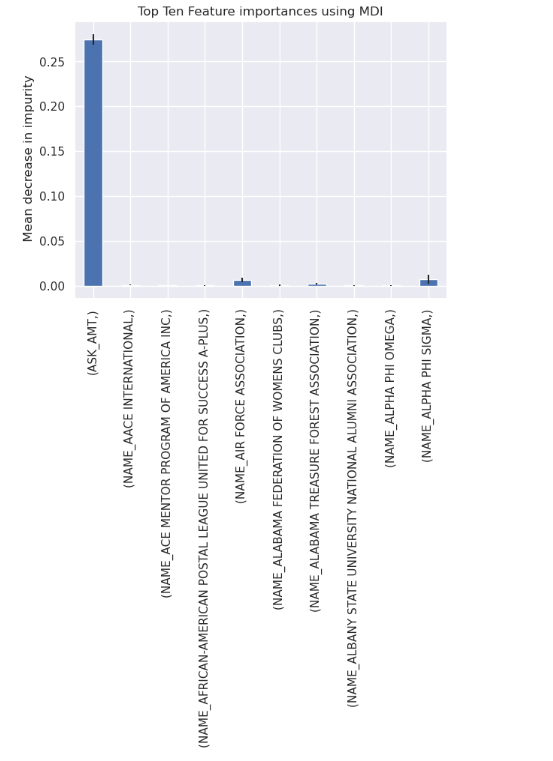
 
 Figure (1.3) Clustered_df DataFrame.

 

## Summary

On this project, we worked primarily with the K-means algorithm, the main unsupervised algorithm that groups similar data into clusters. And  build on this by speeding up the process using principal component analysis (PCA), which employs many different features to reduce the dimensions of the DataFrame. 
 
Then using the K-means algorithm, we created an elbow curve using hvPlot to find the best value for K. Then, runned the K-means algorithm to predict the K clusters for the cryptocurrencies’ data.
 
Finally we created  scatter plots with Plotly Express and hvplot, to visualize the distinct groups that correspond to the three principal components. Then created a table with all the currently tradable cryptocurrencies using the hvplot.table() function. 
 
The ultimate goal for this visualizations is to present the data in a story that would be interactive, easy to understanding and that provide the correct information to help the stakeholders in the decision making process. 

## References

[Markdown](https://docs.github.com/en/get-started/writing-on-github/getting-started-with-writing-and-formatting-on-github/basic-writing-and-formatting-syntax)

[scikit-learn](https://scikit-learn.org/stable/)
 
[K-Means Elbow](https://predictivehacks.com/k-means-elbow-method-code-for-python/)

[matplotlib](https://matplotlib.org/stable/api/_as_gen/matplotlib.pyplot.savefig.html)

